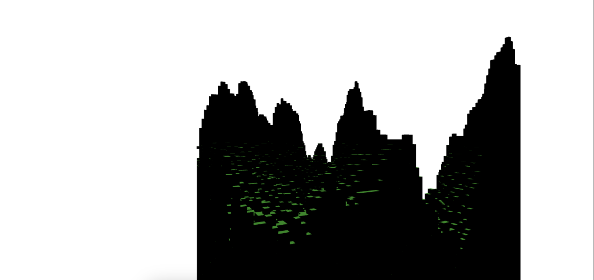
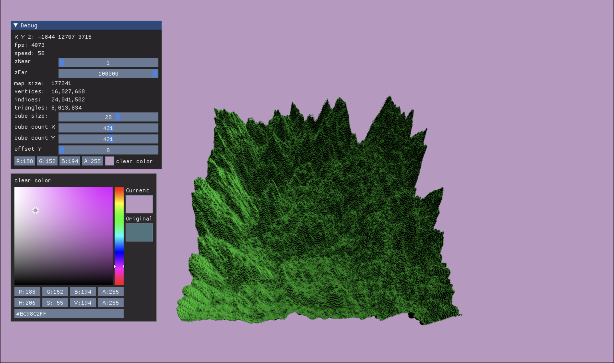

# minecraft

voxel renderer written in js using webgl, hopefully will look like minecraft.

wouldve done it only with 2d canvas rendering context but it is too slow
because fillRectangle is not optimized for this type of stuff.

